

  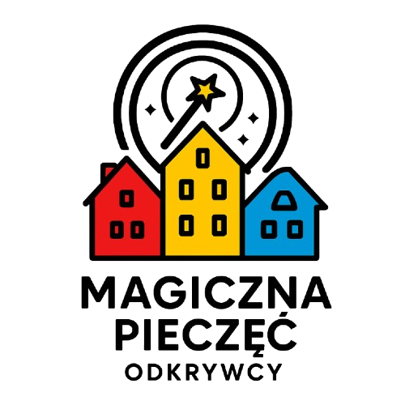

<h1 align="center">🏛️ Magiczna pieczęć odkrywcy - Bydgoszcz</h1>

  <strong>Interaktywna aplikacja do zwiedzania Bydgoszczy</strong> 
  Projekt stworzony w 24 godziny podczas hackathonu <a href="https://hacknation.pl/">HackNation</a>

  <a href="https://bydgoszczmob.tojest.dev/">🌐 Demo Web</a> •
  <a href="https://www.youtube.com/shorts/mKvLFy54uCU">🎬 Demo Video</a> •
  <a href="apk/app-release.apk">📱 Pobierz APK</a> •
  <a href="pitch.pdf">📊 Pitch</a>

---

## 📖 O projekcie

Nasz projekt to interaktywna aplikacja, która zamienia zwiedzanie Bydgoszczy w osobistą, angażującą przygodę. Użytkownik wybiera swoje zainteresowania, a aplikacja tworzy dla niego **spersonalizowane trasy** i **unikalne opowieści** o zabytkach, rzeźbach i ciekawych miejscach miasta.

Dzięki połączeniu nowoczesnych technologii, generowania narracji i przyjaznego UI, zwiedzanie staje się grą, w której można odkrywać sekrety miasta, zbierać medale i tworzyć własne wspomnienia.

**Projekt łączy edukację, rozrywkę i lokalną historię, pokazując Bydgoszcz w zupełnie nowym wymiarze.**

### 👨‍👩‍👧‍👦 Dla kogo?

Aplikacja jest przeznaczona dla wszystkich, ale **szczególnie dla rodziców z dziećmi**. Magiczne opowieści i system nagród zachęcają dzieci do aktywnego odkrywania historii miasta, zamieniając zwykły spacer w ekscytującą przygodę pełną nauki i zabawy. Dzieci uczą się historii w sposób angau017cujący, a rodzice mogą spędzić jakościowy czas z rodziną, odkrywając razem lokalną kulturę.

### 🎯 Realizowane wyzwanie hackathonowe

**Tytuł:** Bydgoszcz – Ścieżki Pamięci 2.0

**Opis wyzwania:** Bydgoszcz skrywa mnóstwo sekretów. Mijamy je codziennie, są ukryte w kamieniu i brązie, w pomnikach, rzeźbach i ciekawych miejscach. Czas, by te historie ożyły.

---

## 🚀 Linki

| | Link |
|---|---|
| 🌐 **Demo Web** | [bydgoszczmob.tojest.dev](https://bydgoszczmob.tojest.dev/) |
| 🎬 **Demo Video** | [YouTube Shorts](https://www.youtube.com/shorts/mKvLFy54uCU) |
| 🎥 **Full Demo Video** | [video.mov](video/video.mov) |
| 📱 **APK Android** | [Pobierz](apk/app-release.apk) |
| 📊 **Pitch** | [pitch.pdf](pitch.pdf) |

### 🎥 Demo Video

<video src="https://raw.githubusercontent.com/dawidope/bydgoszcz-mobile/refs/heads/main/video/video.mov" controls width="100%" style="max-width: 600px;">
  Twoja przeglądarka nie obsługuje odtwarzacza video.
</video>

*Alternatywnie: [YouTube Shorts](https://www.youtube.com/shorts/mKvLFy54uCU) | [Pobierz video.mov](video/video.mov)*

---

## ⚠️ Uwaga dotycząca wersji webowej

Wersja webowa może nie działać idealnie - aplikacja jest **mobile-first** i została zoptymalizowana głównie pod urządzenia mobilne z ekranem dotykowym. Flutter Web nie jest idealny dla aplikacji mobilnych, a niektóre funkcje (kamera, nawigacja, audio) mogą działać inaczej niż na natywnym Androidzie.

Z racji ograniczonego czasu hackathonu (24h), nie mieliśmy możliwości łatwego udostępnienia aplikacji jurorom w formie natywnej aplikacji mobilnej do testowania (proces publikacji w Google Play wymaga czasu), dlatego przygotowaliśmy wersję webową jako demo dostępne dla wszystkich.

**💡 Najlepsze doświadczenie:** Otwórz demo web na telefonie lub zainstaluj APK na urządzeniu z Androidem.

---

## ✨ Główne funkcje

- 🎯 **Personalizacja** - wybierz swoje zainteresowania i otrzymaj dopasowane trasy
- 📍 **Spersonalizowane trasy** - unikalne ścieżki po zabytkach Bydgoszczy
- 📖 **Generowane opowieści** - AI tworzy angażujące historie o każdym miejscu
- 🎧 **Narracja audio** - posłuchaj opowieści podczas zwiedzania
- 🏅 **System medali** - zbieraj pieczęcie i zdobywaj certyfikaty
- 📸 **Zdjęcia miejsc** - dokumentuj swoją przygodę
- 🗺️ **Nawigacja** - prowadzenie do kolejnych punktów na trasie

---

## 📱 Screenshots

  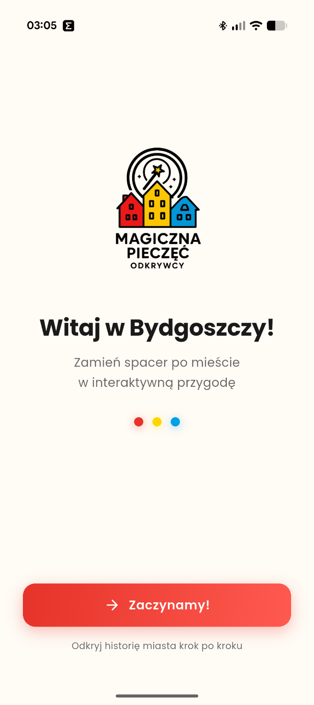
  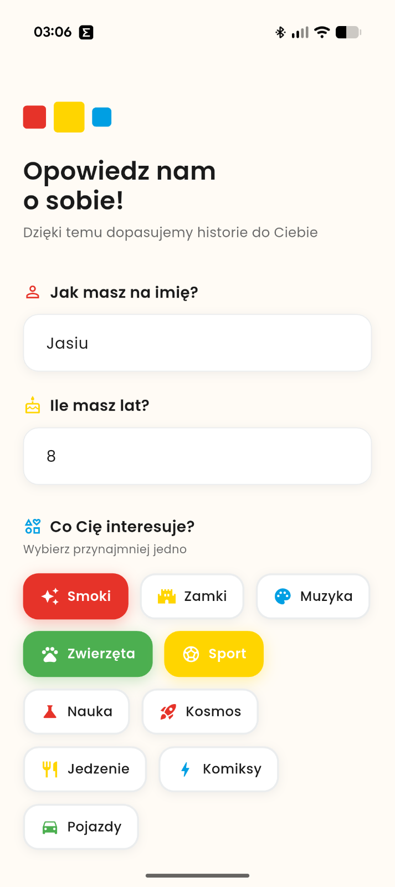
  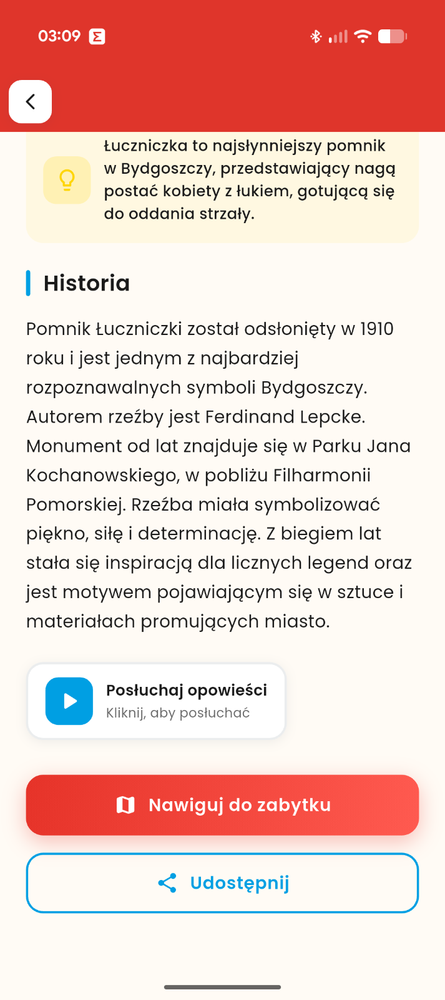
  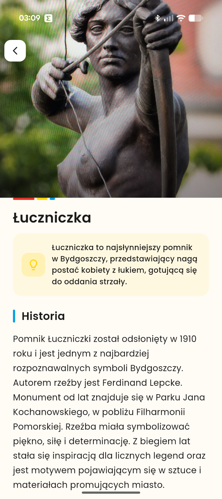

  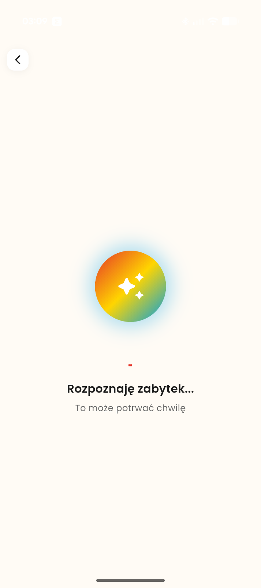
  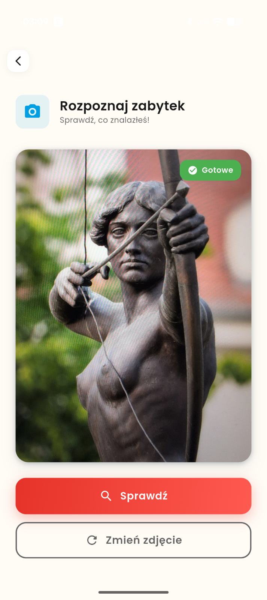
  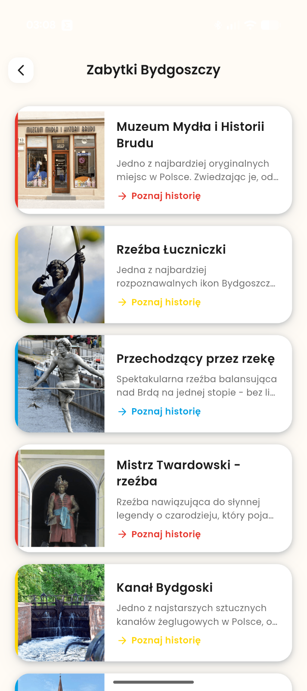
  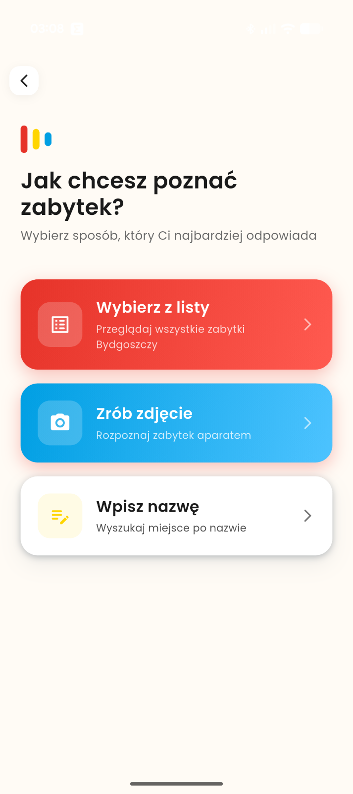

  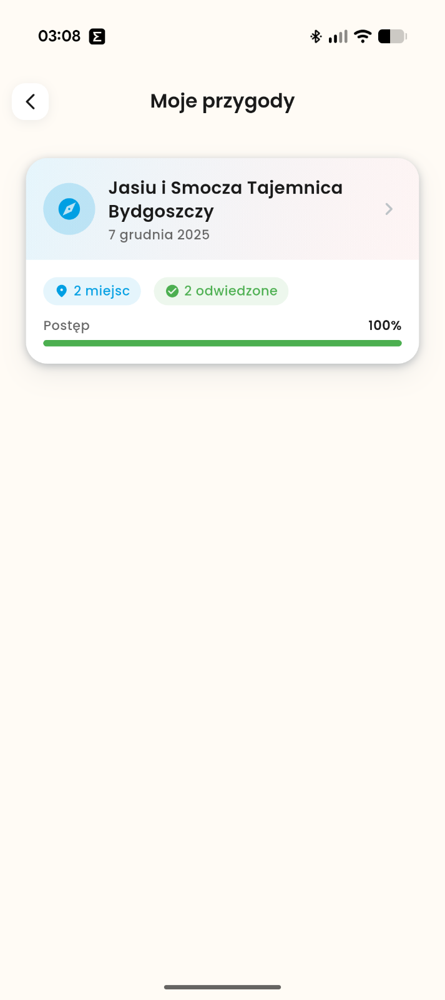
  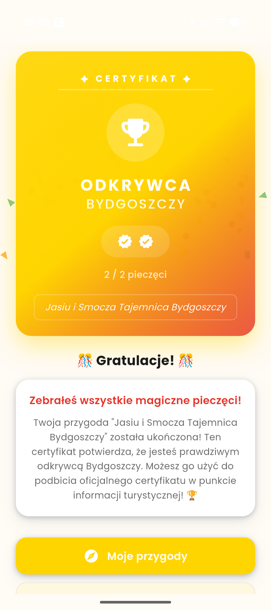
  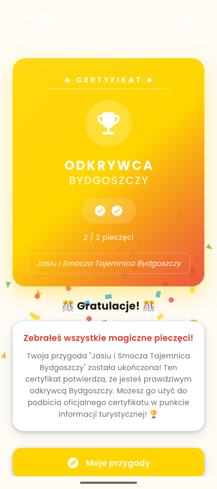
  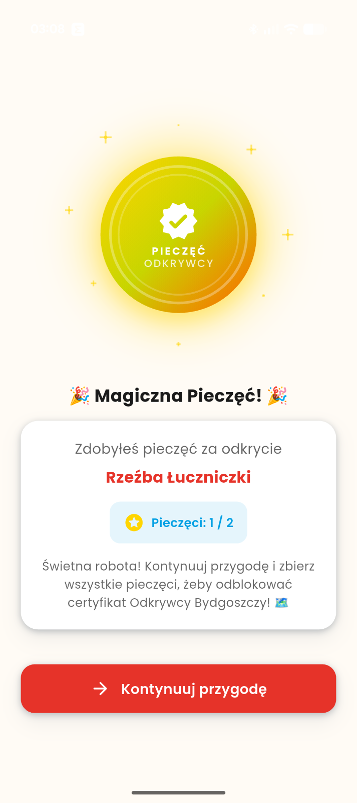

  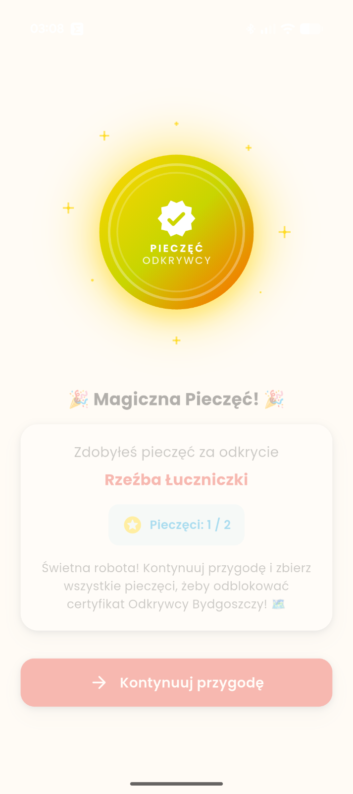
  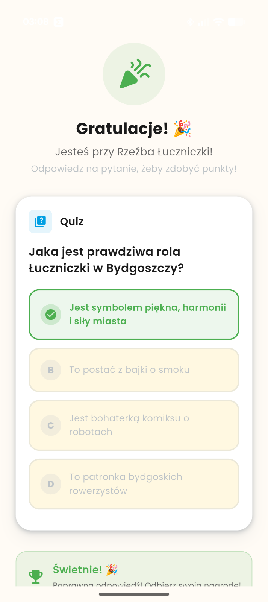
  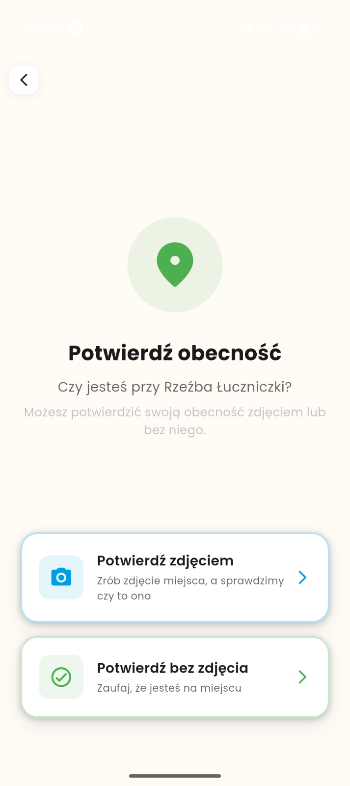
  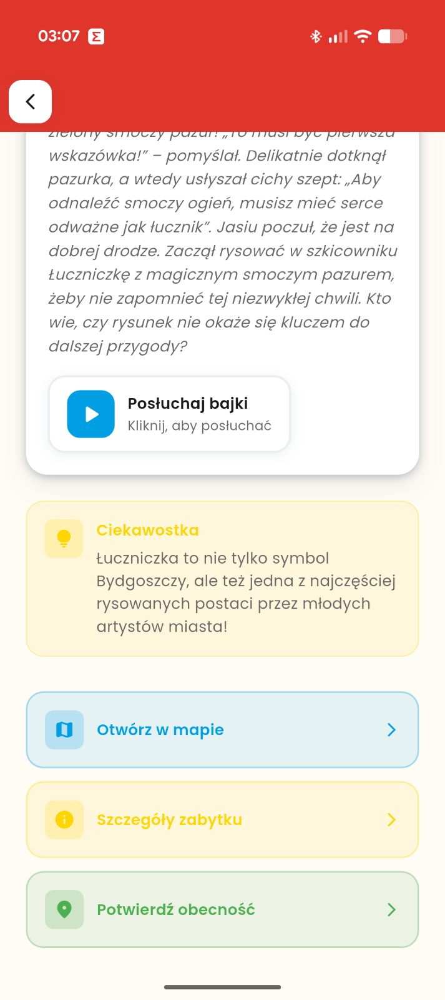

  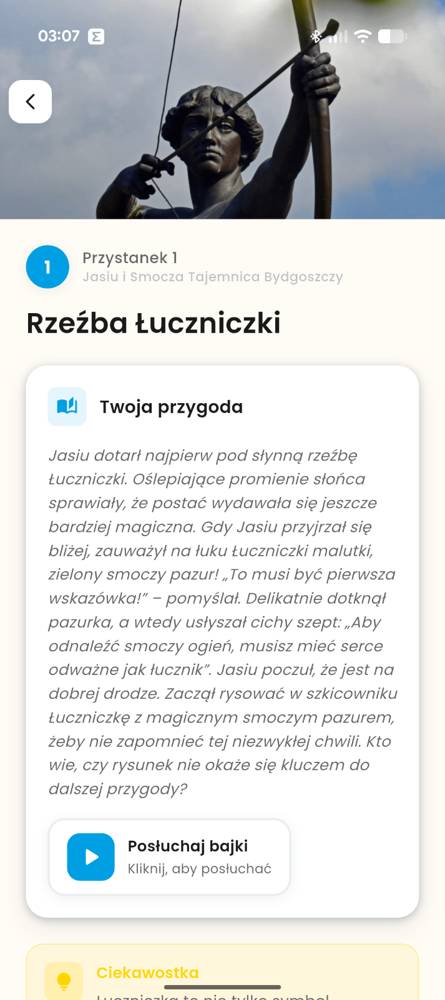
  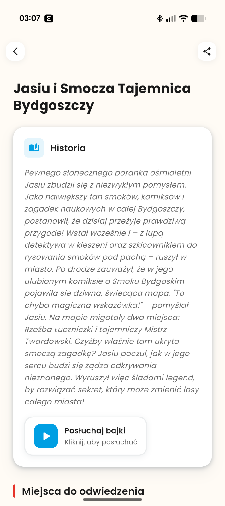
  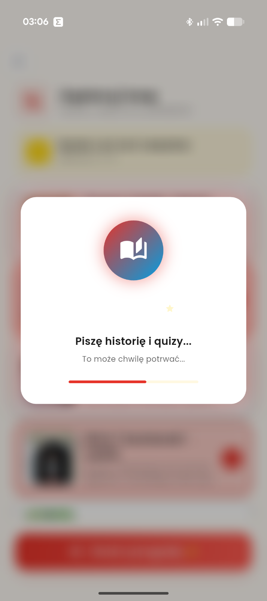
  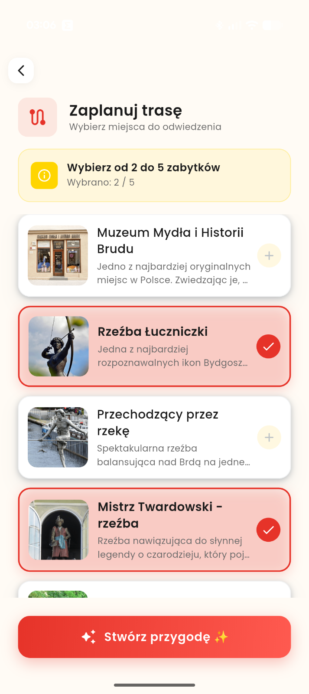

  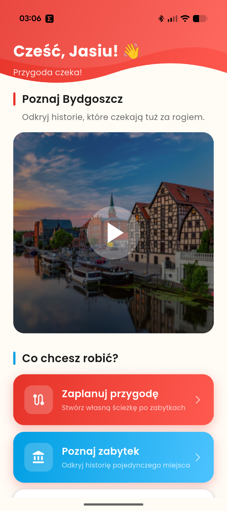

---

## 🛠️ Technologie

### Główne technologie
- **Flutter 3.38+** - framework do budowy aplikacji mobilnych
- **Dart 3.10+** - język programowania

### AI & Generowanie treści
- **OpenAI GPT-4o** - generowanie spersonalizowanych opowieści i narracji
- **OpenAI GPT-4.1** - analiza zdjęć zabytków i rozpoznawanie miejsc
- **OpenAI TTS-1** - synteza mowy dla narracji audio

### Główne biblioteki
- **flutter_bloc (9.1.1)** - zarządzanie stanem aplikacji (Cubit)
- **go_router (15.1.3)** - nawigacja i routing
- **get_it (9.2.0)** - dependency injection
- **dio (5.9.0)** - klient HTTP do komunikacji z API
- **freezed (2.5.8)** - generowanie immutable models
- **shared_preferences (2.3.5)** - lokalne przechowywanie danych

### Multimedia & UI
- **just_audio (0.10.5)** - odtwarzanie audio
- **cached_network_image (3.4.1)** - cache'owanie obrazków
- **image_picker (1.2.1)** - robienie zdjęć zabytków
- **share_plus (12.0.1)** - udostępnianie tras i certyfikatów
- **url_launcher (6.3.1)** - otwieranie nawigacji Google Maps
- **wakelock_plus (1.3.3)** - utrzymywanie ekranu włączonego podczas zwiedzania

---

## 🏆 Hackathon

Projekt powstał w ciągu **24 godzin** podczas hackathonu [HackNation](https://hacknation.pl/) w ramach wyzwania **"Ścieżki Pamięci 2.0"** - tworzenie spersonalizowanych historii i tras po zabytkach Bydgoszczy.

---

  <strong>🌟 Odkryj Bydgoszcz na nowo! 🌟</strong>

